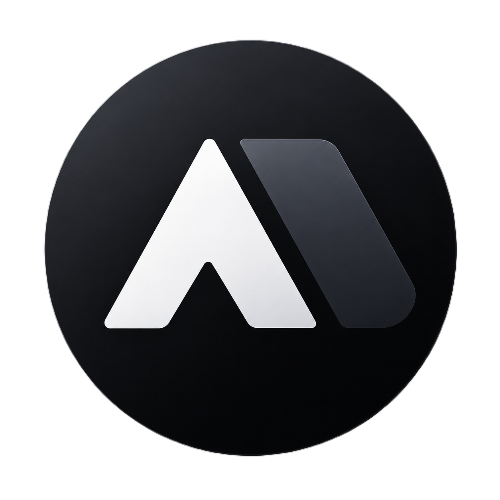

<div align="center">

# LinkOPS Desktop — Website

**The official landing page for [LinkOPS Desktop](../README.md)** — a bilingual
(English ⇄ فارسی) Next.js site with full RTL, three theme modes, and real
screenshots captured from the app itself.



**Next.js 15 · Tailwind CSS · TypeScript · Fully static output**

</div>

---

## ✨ Highlights

| | |
|---|---|
| 🎨 **Pixel-identical to the app** | Same HSL palette, Vazirmatn + JetBrains Mono fonts, cards, borders and dark theme as the desktop app. |
| 🌐 **EN ⇄ فارسی with full RTL** | Every string is hand-written in both languages; `dir="rtl"` flips the whole layout instantly, no hydration flash. |
| 🌗 **Light / Dark / System themes** | Zero-flash inline script in `<head>`, persisted to `localStorage`, follows OS preference in System mode. |
| 📸 **Real screenshots** | Gallery tabs mirror the app's sidebar and show PNGs captured from the running desktop app (see below). |
| ⚡ **Static by default** | `output: static`-style App Router pages prerender to plain HTML — fast, cacheable, no server needed. |
| 📦 **Standalone** | Lives in its own folder with its own `package.json`; the Electron app never needs to build or ship it. |
| 🪟 **Official OS logos** | Windows and Linux logos come from `react-icons/fa6` — they inherit the site's color in both themes. |

---

## 🚀 Quick start

```bash
npm install
npm run dev        # → http://localhost:3000 (HMR)
npm run build      # production build (static HTML in .next)
npm start          # serve the production build locally
npm run lint       # eslint
```

## 🗂 Project structure

```
web/
├── app/
│   ├── layout.tsx        # <html> shell, metadata, no-FOUC theme/lang script
│   ├── page.tsx          # the single landing page
│   └── globals.css       # Tailwind + the app's exact design tokens
├── components/
│   ├── SiteHeader.tsx    # sticky header: nav, theme, language, mobile menu
│   ├── Download.tsx      # per-OS download cards + version badge (FaWindows / FaLinux logos)
│   ├── Pricing.tsx       # 3/6/12-month license plans + yearly discount
│   ├── Hero.tsx          # headline + animated terminal mock
│   ├── Features.tsx      # capability grid
│   ├── Screenshots.tsx   # tabbed gallery of real app screenshots
│   ├── Protocols.tsx     # SSH vs Telnet comparison
│   ├── Security.tsx      # security highlights
│   ├── Cta.tsx           # closing call-to-action
│   ├── Footer.tsx        # footer
│   ├── ThemeToggle.tsx   # light / dark / system
│   └── LangToggle.tsx    # EN / فارسی
├── lib/
│   ├── dictionary.ts     # the full EN + FA copy (hand-written, natural)
│   ├── lang.tsx          # language context (persisted, hydration-safe)
│   ├── theme.tsx         # theme context (persisted, hydration-safe)
│   ├── site.ts           # ⚙️ site config: version + download URLs
│   └── utils.ts          # cn() helper
└── public/
    ├── logo.png                # the app icon (favicon + header/footer)
    └── screenshots/*.png       # real captures from the desktop app
```

---

## ⚙️ Configuration (download links & version)

The user-facing download buttons point at the **#download** section, which
shows a **Windows** card (`.exe` installer with install steps) and a
**Linux** card with two packages — `.deb` (Debian/Ubuntu) and **AppImage**
(any distro) — each with its own install commands.

Set the real links — either edit the fallbacks in `lib/site.ts`, or (better)
set environment variables in Vercel so the same build can be reused:

| Env var | Purpose | Example |
|---|---|---|
| `NEXT_PUBLIC_APP_VERSION` | Version shown on the download cards | `1.0.0` |
| `NEXT_PUBLIC_DOWNLOAD_URL_WINDOWS` | Windows installer (`.exe` / `.msi`) | `https://cdn.example.com/LinkOPS.Desktop.Setup.1.0.0.exe` |
| `NEXT_PUBLIC_DOWNLOAD_URL_LINUX_DEB` | Linux `.deb` package | `https://cdn.example.com/linkops-desktop_1.0.0_amd64.deb` |
| `NEXT_PUBLIC_DOWNLOAD_URL_LINUX_APPIMAGE` | Linux AppImage | `https://cdn.example.com/LinkOPS.Desktop-1.0.0.AppImage` |
| `NEXT_PUBLIC_SITE_URL` | Canonical URL for Open Graph / Twitter cards | `https://linkops.example.com` |
| `NEXT_PUBLIC_PURCHASE_URL` | Checkout link for the pricing “Buy” buttons | `https://checkout.example.com/buy` |
| `NEXT_PUBLIC_CURRENCY` | Currency symbol in the English pricing section | `$` |
| `NEXT_PUBLIC_CURRENCY_FA` | Currency label in the Persian pricing section | `تومان` |

Until a URL is set, the matching button is disabled, so the site never
renders broken links. Pricing plans (3/6/12 months with a 33% discount on
the yearly term) live in `lib/site.ts` as `PLANS` — edit prices there or
override via env if you ever need to.

## 💳 Pricing section

`#pricing` shows three license plans (`lib/site.ts` → `PLANS`), with **dual
pricing**: the English UI shows USD, the Persian (فارسی) UI shows Toman
automatically based on the active language:

| Plan | USD | USD compare-at | Toman | Toman compare-at | Discount |
|---|---|---|---|---|---|
| 3 months | $14.99 | — | ۱٬۴۹۰٬۰۰۰ تومان | — | — |
| 6 months | $24.99 | $29.98 | ۲٬۴۹۰٬۰۰۰ تومان | ۲٬۹۹۰٬۰۰۰ تومان | 17% |
| 12 months | $39.99 | $59.96 | ۳٬۹۹۰٬۰۰۰ تومان | ۵٬۹۹۰٬۰۰۰ تومان | 33% (featured) |

The 12-month card is highlighted as “Best value”. Prices are per machine,
per term. Each “Buy” button links to `PURCHASE_URL` when set (otherwise it
scrolls to `#download`), so the site works even before the checkout is wired
up. The install steps shown on the cards (Windows wizard,
`sudo apt install ./…deb`, `chmod +x …AppImage`) are static copy in
`lib/dictionary.ts` — update them together with the version if filenames
change.

---

## 🧠 Architecture notes

- **Hydration-safe persistence** — both the language and theme providers start
  with the server default and apply the saved value in a mount effect, while a
  tiny inline script in `app/layout.tsx` sets `<html lang/dir>` and the dark
  class *before first paint*. Result: no hydration mismatch, no flash.
- **RTL** — switching to فارسی sets `dir="rtl"` on `<html>`; Tailwind classes
  are direction-agnostic (flex/grid) so the layout mirrors cleanly.
- **Fonts** — bundled via `@fontsource-variable`: Vazirmatn (Persian) and
  JetBrains Mono (terminal/`mono-tag` text), so rendering is identical on
  every machine with no external requests.
- **Static output** — no server-only data; the whole page prerenders to static
  HTML for Vercel's edge CDN.

---

## 📸 Regenerating the screenshots

Screenshots are captured from the **real desktop app** (not mocked) by the
repo's smoke-test infrastructure. From the repository root:

```bash
npm run build
LINKOPS_SHOTS=1 npx electron out/main/index.js
```

This runs the app headlessly with a **throwaway database**, seeds a realistic
inventory (devices, groups, tags, command templates), opens live SSH sessions
against a local test server, runs commands and a batch run, then walks every
page and writes PNGs to `web/public/screenshots/`:

```
dashboard.png  devices.png  device-detail.png  sessions.png  batch-runs.png
commands.png   command-groups.png  history.png  logs.png  settings.png
```

Screenshots are always captured with the **dark theme and English UI** so the
gallery matches the site's default presentation, and each run starts from a
fresh database — no accumulating demo data.

---

## ☁️ Deploying to Vercel

The site is a standard Next.js app; the only setting that matters is pointing
Vercel at the `web` folder.

### Via the Vercel dashboard

1. Push the repository to GitHub / GitLab / Bitbucket.
2. **Add New → Project** and import the repo.
3. Set **Root Directory** to `web` (the site is intentionally self-contained —
   this keeps the Electron app and the website completely independent).
4. (Optional) add the `NEXT_PUBLIC_*` variables from the table above.
5. **Deploy.** Every push to the production branch redeploys automatically.

### Via the CLI

```bash
npm i -g vercel
cd web
vercel            # first time: link the project, deploy a preview
vercel --prod     # production
```

> **Tip:** because the output is fully static, you can also export it
> (`next build` already prerenders all routes) and host the result on any
> static file server or CDN.

---

## 🧪 Verification

```bash
npm run build     # must end with "○  (Static)  prerendered as static content"
npm run lint      # eslint — no errors
```

Manual smoke checklist:

- [ ] Switch to فارسی — everything flips RTL, dates/digits render Persian.
- [ ] Toggle Light / Dark / System — persists across reloads; System follows the OS.
- [ ] Click any **Download** button — the page scrolls to the `#download` section.
- [ ] Scroll to **Pricing** — 3 cards, the 12-month one highlighted with its discount.
- [ ] Open the gallery tabs — each shows the matching real app screenshot.

---

## 📄 License

The site content is part of the LinkOPS Desktop project; see the repository
root for licensing. The bundled fonts (Vazirmatn, JetBrains Mono) are SIL OFL
1.1 licensed.
